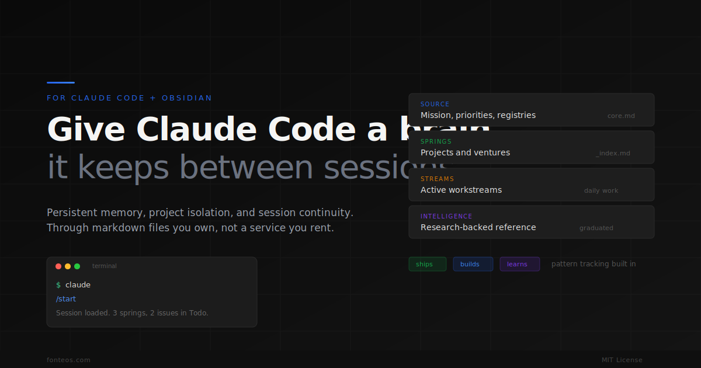

<p align="center">
  
</p>

<h1 align="center">FonteOS</h1>

<p align="center">
  <strong>A strategy and execution layer for solo founders and small teams using Claude Code.</strong>
</p>

<p align="center">
  <a href="https://fonteos.com">Website</a> &middot;
  <a href="#quickstart">Quickstart</a> &middot;
  <a href="docs/getting-started.md">Docs</a> &middot;
  <a href="https://opensource.org/licenses/MIT">
    
  </a>
</p>

---

FonteOS gives Claude Code **persistent memory**, **project isolation**, and **session continuity**. It's a vault structure + behavioral rules — no server, no database, no build step. Clone it, open it, `/start`.

> *"Fonte" is Portuguese for spring — the source where streams begin.*

---

## The problem

Every Claude Code session starts from zero. You re-explain your context, lose decisions between conversations, burn tokens re-loading what should already be there, and watch projects bleed into each other with no isolation. There's no structure connecting **what to build** to **what to do next**.

FonteOS fixes this with two files and six folders.

---

## How it works

**Two control files:**

| File | Purpose |
|------|---------|
| `CLAUDE.md` | Behavioral rules Claude reads automatically — session protocol, write permissions, standing rules |
| `source/core.md` | Your operating context — mission, priorities, project registry. Claude reads it and knows your world |

**Six-layer vault:**

```
┌─────────────────────────────────────────────────────┐
│  SOURCE        Mission, priorities, registries       │
├─────────────────────────────────────────────────────┤
│  SPRINGS       Projects/ventures, each with an index │
├─────────────────────────────────────────────────────┤
│  STREAMS       Active workstreams (daily work here)  │
├─────────────────────────────────────────────────────┤
│  INTELLIGENCE  Research-backed reference knowledge   │
├─────────────────────────────────────────────────────┤
│  AGENTS        AI agent role definitions             │
├─────────────────────────────────────────────────────┤
│  INBOX         Loose ideas, triaged weekly           │
└─────────────────────────────────────────────────────┘
```

**Session lifecycle:**

```
/start → load context, suggest work, scope to a project
   ↓
 work  → read/write within scope, fetch live data via MCP
   ↓
 /end  → summarize, upstream insights, save state for next session
```

**Token-efficient by design.** ~5k tokens of loaded context, not your entire life. MCP integrations pull live data on demand — external data stays external until needed.

---

## Quickstart

### 1. Clone

```bash
git clone https://github.com/luke-toledo/fonteOS.git my-vault
cd my-vault
```

### 2. Open in Obsidian

Open the folder as an Obsidian vault. Any markdown editor works — Obsidian gives you the graph view.

### 3. Start Claude Code

```bash
claude
```

### 4. First run

```
/start
```

On first run, Claude detects an empty `core.md` and walks you through setup:

- **Who you are** and what you're building
- **Your top priorities** right now
- **Task manager** preference — Linear, Asana, or vault-only

After setup, every `/start` loads your full context instantly.

---

## Vault structure

```
my-vault/
├── CLAUDE.md                          ← Behavioral rules (auto-loaded)
├── source/
│   ├── core.md                        ← Mission, priorities, registries
│   └── session-state.md               ← Last session pickup
├── springs/
│   └── my-project/
│       ├── my-project_index.md        ← Project overview
│       └── stream/
│           └── .gitkeep
├── intelligence/
│   └── .gitkeep
├── agents/
│   └── .gitkeep
├── inbox/
│   └── .gitkeep
└── .claude/
    └── commands/
        ├── start.md                   ← Session open
        ├── end.md                     ← Session close
        ├── audit.md                   ← Monthly maintenance
        └── note.md                    ← Quick note creation
```

---

## Key concepts

| Concept | What it means |
|---------|---------------|
| **Source** | `core.md` — your mission, priorities, and project registry |
| **Spring** | A project or venture. Has an index and streams |
| **Stream** | Active work within a spring. Claude writes here freely |
| **Intelligence** | Research-backed reference. Slow-changing, confidence-rated |
| **Upstream** | Codify session output into a permanent file |
| **Dispose** | Close a session without extracting anything |
| **Graduate** | Promote a recurring stream insight to Intelligence |

---

## ADHD guardrails

FonteOS was built by someone with ADHD, for people who work like that. Every session has built-in structure:

- **Ships / Builds / Learns** — every task gets a type so you always know if you're shipping to market, building infrastructure, or doing research
- **Session deliverables** — declare what "done" looks like before starting, not after
- **Pattern monitoring** — watches for scope creep, prerequisite chains, and building-without-shipping in real time
- **Spring isolation** — forces single-project focus per session. Cross-project edits require explicit approval

---

## Commands & skills

### Commands (built-in)

| Command | What it does |
|---------|-------------|
| `/start` | Load context, suggest work, declare deliverable, scope to a project |
| `/end` | Summarize, drift check, verify, upstream or dispose, save state |
| `/audit` | Monthly maintenance — orphans, stale streams, pattern health, drift |
| `/note` | Create a new note with structure and wikilinks |
| `/cycle` | Daily agent cycle — scan issues, classify, execute, report |
| `/patterns` | Quick pattern health check — ship queue, ratios, streaks |
| `/review` | Two-stage quality review — gap analysis then counter-review |

### Skills (extensible)

Skills are reusable prompt files in `~/.claude/skills/`. FonteOS ships lean — add what you need:

| Skill pattern | Examples |
|---------------|----------|
| `d-*` | Design skills — `d-polish`, `d-critique`, `d-animate`, `d-audit` |
| Research | `perplexity`, `youtube`, `mark` |
| Content | `story-edit`, `humanize` |
| System | `review`, `patterns`, `cycle` |

---

## Write permissions

| Layer | Claude can write? | Notes |
|-------|-------------------|-------|
| Streams | **Yes** | Daily work, drafts |
| Inbox | **Yes** | Catching ideas |
| Session state | **Yes** | Auto-written at `/end` |
| Spring indexes | Propose only | Human approves |
| Intelligence | Propose only | Human approves |
| Source | Propose only | Human approves |
| CLAUDE.md | **Never** | Human-only |

---

## Integrations (MCP)

FonteOS works standalone, but gets powerful with MCP servers:

| Integration | What it does |
|-------------|-------------|
| **Linear / Asana** | Pull tasks at `/start`, update at `/end`, daily cycle automation |
| **Perplexity** | Deep research without leaving the terminal |
| **Gemini** | YouTube extraction, document analysis, vision |
| **Google Drive** | Read spreadsheets and docs as intelligence sources |
| **Figma** | Read designs, extract tokens, generate components |
| **Google Calendar** | Schedule-aware planning and time blocking |

See [docs/mcp-integrations.md](docs/mcp-integrations.md) for setup.

---

## What it's NOT

| | |
|---|---|
| **Not a chatbot** | It's a working context for Claude Code |
| **Not a RAG pipeline** | No vectors, no embeddings — just markdown files loaded strategically |
| **Not a SaaS** | No server, no account, no subscription |
| **Not an installer** | It's a file structure — clone and go |

---

## Documentation

| Doc | What it covers |
|-----|---------------|
| [Getting Started](docs/getting-started.md) | Full setup walkthrough |
| [Core Concepts](docs/concepts.md) | Springs, streams, intelligence, upstream |
| [Session Lifecycle](docs/session-lifecycle.md) | `/start` → work → `/end` in detail |
| [Settings & Configuration](docs/settings.md) | Hooks, permissions, user-level vs project-level |
| [Customization](docs/customization.md) | Making it yours |
| [MCP Integrations](docs/mcp-integrations.md) | Connecting external tools |
| [Voice Profiles](docs/voice-profiles.md) | Teaching Claude your writing style |
| [Multi-session Work](docs/advanced/multi-session.md) | Spring isolation and cross-over |
| [Daily Cycle Automation](docs/advanced/daily-cycle.md) | Automated agent runs |

---

## License

[MIT](LICENSE)

---

## Credits

Built by [Luke Toledo](https://x.com/lukeSVG) in Lisbon.

Born from running multiple ventures with Claude Code and needing a system that doesn't forget.
